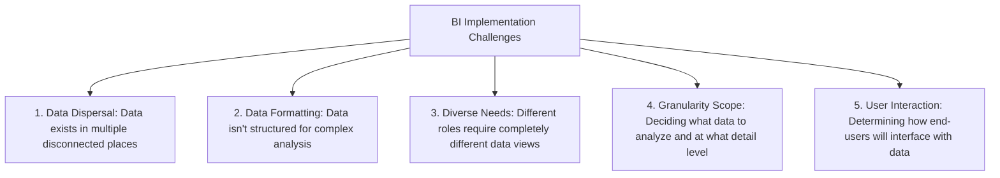
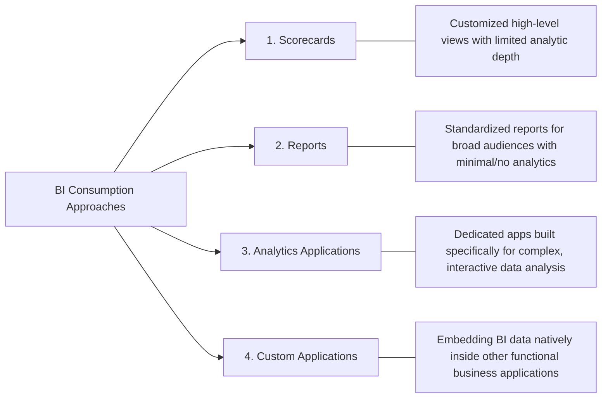
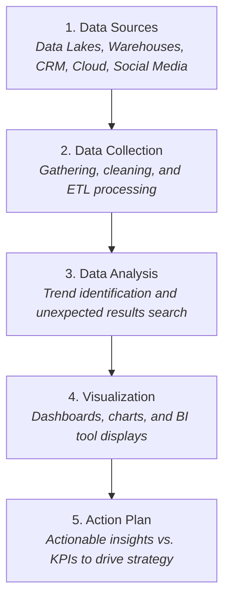
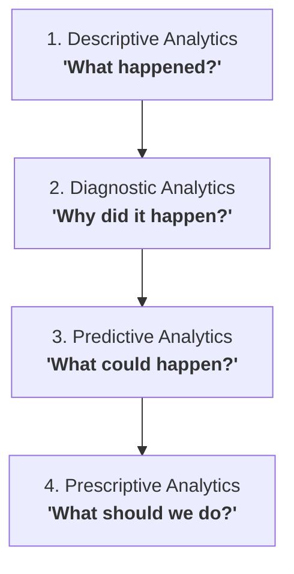

# BI Architecture and Lifecycle: Comprehensive Exam Reviewer

## Table of Contents

- [BI Architecture and Lifecycle: Comprehensive Exam Reviewer](#bi-architecture-and-lifecycle-comprehensive-exam-reviewer)
  - [Table of Contents](#table-of-contents)
  - [1. Core BI Concepts \& Importance](#1-core-bi-concepts--importance)
    - [Definition of Business Intelligence (BI)](#definition-of-business-intelligence-bi)
    - [Primary Purpose \& Business Value](#primary-purpose--business-value)
  - [2. Industry Use Cases](#2-industry-use-cases)
  - [3. Challenges in Building BI Solutions](#3-challenges-in-building-bi-solutions)
  - [4. Approaches to Consuming BI](#4-approaches-to-consuming-bi)
  - [5. BI Architecture \& Data Flow](#5-bi-architecture--data-flow)
    - [The 5 Architectural Layers](#the-5-architectural-layers)
  - [6. The Analytics System Framework](#6-the-analytics-system-framework)
  - [7. The 4 Types of Data Analytics](#7-the-4-types-of-data-analytics)
  - [8. Analytics System vs. Technology System](#8-analytics-system-vs-technology-system)
  - [9. Quick-Recall Exam Prep \& Cheat Sheet](#9-quick-recall-exam-prep--cheat-sheet)
    - [Common Trap Questions \& Key Distinction Rules](#common-trap-questions--key-distinction-rules)

---

## 1. Core BI Concepts & Importance

### Definition of Business Intelligence (BI)

* **What it is:** The software, data tools, infrastructure, and best practices used to transform raw data into actionable business decisions.
* **The Core Knowledge Continuum:**

$$\text{Data} \longrightarrow \text{Information} \longrightarrow \text{Knowledge} \longrightarrow \text{Plans (Action)}$$

* **Components Included:** Data Warehousing, Business Analytics, and Knowledge Management.

### Primary Purpose & Business Value

BI allows companies to view **present and historical data** in business context to drive profitability and efficiency.

* **Key Benefits:**
* Identify ways to increase profit
* Analyze customer behavior
* Compare internal data with competitors
* Track performance against metrics
* Optimize business operations
* Predict success and spot market trends
* Discover root causes of operational issues

---

## 2. Industry Use Cases

| Industry | Primary BI Applications & Benefits |
| --- | --- |
| **Customer Service** | Unified data sources combine customer info and product details so agents resolve questions and issues quickly. |
| **Finance & Banking** | Combines customer history and market conditions to evaluate health, detect risk, predict success, and analyze branch performance. |
| **Healthcare** | Patient self-service answers, real-time inventory tracking, and operational efficiency without burdening staff. |
| **Retail & Insurance** | Benchmarks performance across stores/channels; tracks insurance claims processes to correct missed service targets. |
| **Sales & Marketing** | Unifies promo, pricing, sales, and customer action data for targeted customer segmentation and campaign planning. |
| **Security & Compliance** | Centralized dashboards isolate root causes of security issues and simplify regulatory reporting. |
| **Supply Chain** | Uses a **Single Pane of Glass (SPOG)** to manage global data, speed up goods movement, and resolve bottlenecks. |

---

## 3. Challenges in Building BI Solutions

Creating an effective BI platform requires overcoming five main architectural and design hurdles:

---

## 4. Approaches to Consuming BI

Different users require different interaction styles with BI data.

---

## 5. BI Architecture & Data Flow

### The 5 Architectural Layers

BI architecture processes raw inputs into actionable decisions across five sequential stages:

---

## 6. The Analytics System Framework

Building a complete analytics environment requires balancing **6 core pillars**:

1. **Business & Quality Context:** Understanding overall organizational performance goals so analytics directly inform decision-making.
2. **Stakeholders & Users:** Identifying all individuals or groups impacted by, using, or interested in the analytical solution.
3. **Processes & Data:** Managing raw data materials alongside the business workflows tightly coupled with them.
4. **Tools & Techniques:** Ensuring software matches the technical needs of data builders and the usability needs of end-users.
5. **Team & Training (PEOPLE):** **The most critical component.** Focuses on recruiting, retaining, and upskilling talent.
6. **Technology & Infrastructure:** Evaluating hardware capacity (servers, networks, storage) to prevent bottlenecks under analytic load.

---

## 7. The 4 Types of Data Analytics

Analytics projects fall into four distinct categories based on complexity and strategic value:

* **1. Descriptive Analytics**
* **Question answered:** What happened in the past?
* **Function:** Examines historical data to baseline trends (e.g., calculating average monthly sales for the past year).

* **2. Diagnostic Analytics**
* **Question answered:** Why did it happen?
* **Function:** Deep-dives into datasets to compare variables and isolate root causes (e.g., investigating why sales dropped in a specific month).

* **3. Predictive Analytics**
* **Question answered:** What could happen in the future?
* **Function:** Applies historical data patterns to forecast future outcomes (e.g., forecasting next quarter's revenue).

* **4. Prescriptive Analytics**
* **Question answered:** What action should be taken?
* **Function:** Recommends specific strategies to exploit predicted outcomes (e.g., recommending optimal marketing spend allocation to maximize upcoming sales).

---

## 8. Analytics System vs. Technology System

Exam questions frequently test the distinctions between these two systems:

| Aspect | Analytics System | Technology System |
| --- | --- | --- |
| **Primary Focus** | Provides **actionable insights** for decision-making via data analysis, models, and statistical methods. | Provides **infrastructure and tools** needed to store, process, and manage data. |
| **Key Components** | Context, Stakeholders, Processes, Tools, and **Skilled People/Training**. | Hardware (servers, networks), Software (databases), ETL pipelines, and Integrated Platforms. |
| **Role of Data** | Raw material converted into insights and predictive models. | Materials transformed, transported, and stored across infrastructure. |
| **Primary Output** | Insights, dashboards, statistical models, strategy recommendations. | Infrastructure stability, high system availability, security, fast throughput. |
| **Primary Users** | Business Analysts, Data Scientists, Executive Decision-makers. | IT Engineers, System Administrators, Database Administrators (DBAs). |
| **Concrete Examples** | Predictive models in Python/R; dashboards in Power BI or Tableau. | SQL Server, Oracle DB, Cloud (AWS, Azure), ETL Data Pipelines. |

---

## 9. Quick-Recall Exam Prep & Cheat Sheet

### Common Trap Questions & Key Distinction Rules

* **Single Pane of Glass (SPOG):** A supply chain term for consolidating global operations data onto a single screen to locate bottlenecks.
* **People First Rule:** If asked to pick the **most important consideration** in an analytics framework, the answer is always **People / Team & Training**.
* **Data Flow Progression:** Remember the exact order: $\text{Sources} \rightarrow \text{Collection} \rightarrow \text{Analysis} \rightarrow \text{Visualization} \rightarrow \text{Action Plan}$.
* **System Difference Shortcut:**
* **Technology System** = *Hardware/Software/Storage* (Built by IT to run reliably without continuous human design changes).
* **Analytics System** = *Insights/Models/People* (Built for business decision-makers to answer strategic questions).
