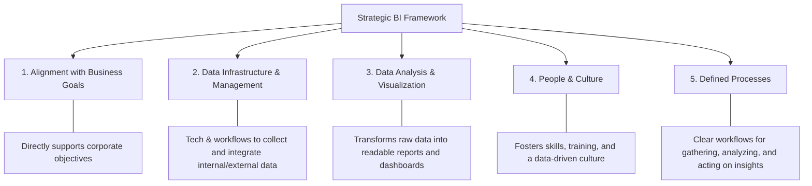
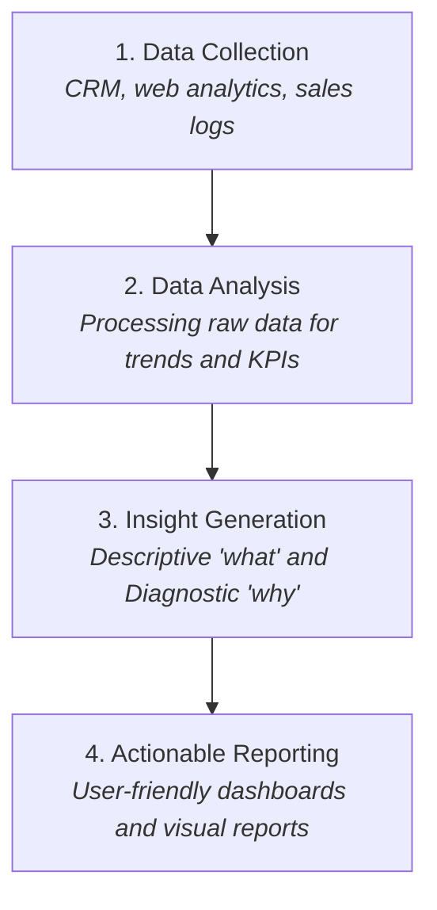
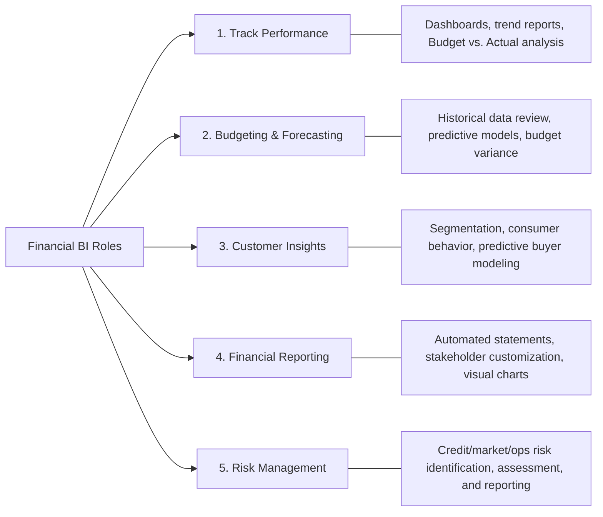
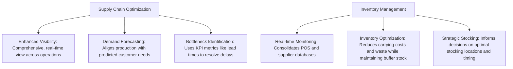

# Strategic Approaches of Business Intelligence: Comprehensive Exam Reviewer

## Table of Contents

- [Strategic Approaches of Business Intelligence: Comprehensive Exam Reviewer](#strategic-approaches-of-business-intelligence-comprehensive-exam-reviewer)
  - [Table of Contents](#table-of-contents)
  - [1. Core Concepts of Strategic BI](#1-core-concepts-of-strategic-bi)
    - [Definition of Strategic Business Intelligence (Strategic BI)](#definition-of-strategic-business-intelligence-strategic-bi)
  - [2. 5 Key Components of Strategic BI](#2-5-key-components-of-strategic-bi)
  - [3. Core Benefits of Strategic BI](#3-core-benefits-of-strategic-bi)
  - [4. Business Intelligence in Marketing](#4-business-intelligence-in-marketing)
    - [Workflow of Marketing BI](#workflow-of-marketing-bi)
    - [Key Marketing Applications \& Benefits](#key-marketing-applications--benefits)
  - [5. Business Intelligence in Finance](#5-business-intelligence-in-finance)
    - [Core Roles of Financial BI](#core-roles-of-financial-bi)
  - [6. Business Intelligence in Operations](#6-business-intelligence-in-operations)
  - [7. Cross-Functional Summary Table](#7-cross-functional-summary-table)
  - [8. Quick-Recall Exam Prep \& Cheat Sheet](#8-quick-recall-exam-prep--cheat-sheet)
    - [Common Exam Traps \& High-Yield Facts](#common-exam-traps--high-yield-facts)

---

## 1. Core Concepts of Strategic BI

### Definition of Strategic Business Intelligence (Strategic BI)

* **What it is:** A comprehensive plan and methodology for leveraging data and analytics to align with and achieve an organization's overall corporate objectives.
* **Primary Purpose:** Enables informed, data-driven decision-making that drives operational performance, exposes new market opportunities, and secures a sustainable competitive advantage.
* **Core Philosophy:** Moves organizations away from instinct or assumption-based decisions toward fact-based strategy.

---

## 2. 5 Key Components of Strategic BI

1. **Alignment with Business Goals:** The strategy must directly map to corporate strategies and high-level objectives.
2. **Data Infrastructure and Management:** Building technologies and processes to collect, integrate, and organize data from varied internal and external sources.
3. **Data Analysis and Visualization:** Utilizing analytical software to convert raw data inputs into dashboards, charts, and actionable reports.
4. **People and Culture:** Empowering business users through skill development, continuous training, and administrative support to nurture a data-driven culture.
5. **Defined Processes:** Establishing clear standard operating procedures (SOPs) for data collection, analysis, interpretation, and strategic implementation.

---

## 3. Core Benefits of Strategic BI

* **Improved Decision-Making:** Replaces instinct and unverified assumptions with fact-based evidence.
* **Increased Efficiency:** Locates workflow bottlenecks, optimizes resource usage, and streamlines operational throughput.
* **Competitive Advantage:** Tracks emerging market trends, shifts in consumer behavior, and competitor movements to capture market share.
* **Better Resource Allocation:** Analyzes unit-level performance metrics to distribute financial, physical, and human capital effectively.
* **Enhanced Innovation:** Uncovers market gaps and operational opportunities to drive digital transformation and new product ideas.

---

## 4. Business Intelligence in Marketing

### Workflow of Marketing BI

Marketing BI leverages software to evaluate customer data, driving customer insights, target audience segmentation, and campaign performance evaluation.

### Key Marketing Applications & Benefits

| Application Area | Functionality & Mechanism | Key Business Benefit |
| --- | --- | --- |
| **Customer Insights** | Analyzes interactions across products and services to determine demographics, behaviors, and needs. | **Better Customer Experience:** Tailors strategies to boost satisfaction and customer retention. |
| **Customer Segmentation** | Divides the total customer base into distinct sub-groups based on shared characteristics. | **Enhanced Targeting:** Delivers highly relevant, personalized messaging to targeted audiences. |
| **Campaign Analysis** | Measures real-time and historical performance of promotions and marketing channels. | **Improved ROI:** Optimizes marketing ad spend by reallocating funds to high-performing campaigns. |

---

## 5. Business Intelligence in Finance

Financial BI converts raw accounting data into actionable financial narratives, tracking performance, streamlining reporting, and uncovering risk.

### Core Roles of Financial BI

1. **Track Financial Performance:**
    * **Interactive Dashboards:** Displays real-time sales, expenses, and margins.
    * **Financial Reports:** Uncovers structural patterns over extended periods.
    * **Budget vs. Actual Analysis:** Pinpoints variance discrepancies between budgeted targets and real spending to drive corrective action.

2. **Budgeting and Forecasting:**
    * **Historical Data Analysis:** Evaluates past outcomes to establish baseline trajectory trends.
    * **Predictive Models:** Combines historical trends with external macroeconomic factors to project future results.
    * **Budget vs. Forecast Comparison:** Compares planned forecasts with real-time operational outputs.

3. **Understanding Customers (Financial Lens):**
    * **Financial Customer Segmentation:** Groups customers by demographic, spending tier, or buying frequency.
    * **Consumer Behavior Analysis:** Measures how customer spending changes relative to product variations.
    * **Predictive Modeling:** Models future customer lifetime values and purchasing trajectories.

4. **Automated Financial Reporting:**
    * **Statement Preparation:** Automates income statements, balance sheets, and cash flow statements.
    * **Customization & Automation:** Generates tailor-made reports for investors or regulators while removing manual entry errors.
    * **Data Visualization:** Translates complex ledger assets into clear graphs.

5. **Risk Management:**
    * **Risk Identification:** Uncovers exposure in credit, market, and operational domains.
    * **Risk Assessment:** Evaluates risk probability against potential financial impact to prioritize mitigation.
    * **Risk Reporting:** Communicates risk profiles and mitigation effectiveness to auditors and executive boards.

---

## 6. Business Intelligence in Operations

Operations BI integrates data feeds from supply chain channels, inventory systems, and point-of-sale platforms to drive real-time operational efficiency.

---

## 7. Cross-Functional Summary Table

| Domain | Key Data Sources | Primary BI Metrics / Outputs | Strategic Business Impact |
| --- | --- | --- | --- |
| **Marketing** | CRM, Web Analytics, Social Media, Sales Logs | Customer Lifetime Value (CLV), Segmentation, Campaign ROI | Enhanced customer targeting, higher ad ROI, improved user experience |
| **Finance** | Accounting Software, Stock Records, General Ledgers | Budget vs. Actual, Cash Flow, Risk Exposure Models | Reduced costs, accurate financial projections, improved audit transparency |
| **Operations** | POS Systems, Warehouse Logs, Supplier Databases | Lead Times, Carrying Costs, Stock Levels, Throughput | Streamlined supply chains, zero bottleneck delays, optimized inventory holding |

---

## 8. Quick-Recall Exam Prep & Cheat Sheet

### Common Exam Traps & High-Yield Facts

* **The "People and Culture" Element:** Software alone is not Strategic BI. Without training and human adoption, BI initiatives fail.
* **Budget vs. Actual Analysis:** A fundamental financial BI capability used to catch spending discrepancies early so managers can take corrective action.
* **Types of Analytics in Marketing BI:** Step 3 of the Marketing BI process specifically utilizes **Descriptive** (*what happened*) and **Diagnostic** (*why it happened*) analytics.
* **Carrying Costs vs. Buffer Stock:** Inventory BI minimizes **carrying costs** (holding unnecessary extra stock) while retaining sufficient **buffer stock** (to insulate against sudden supply spikes or chain disruptions).
* **Core Difference between Strategic BI vs. Operational BI:** Strategic BI focuses on **long-term corporate alignment and high-level goal achievement**, whereas operational BI focuses on daily task execution and immediate monitoring.