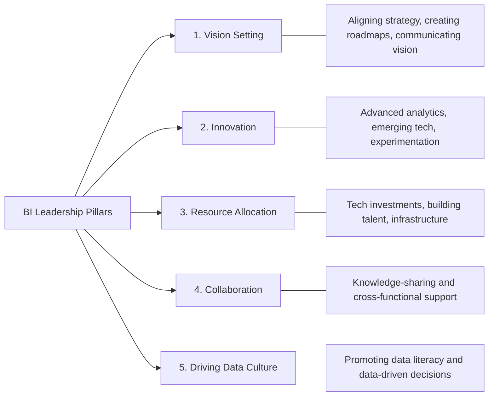
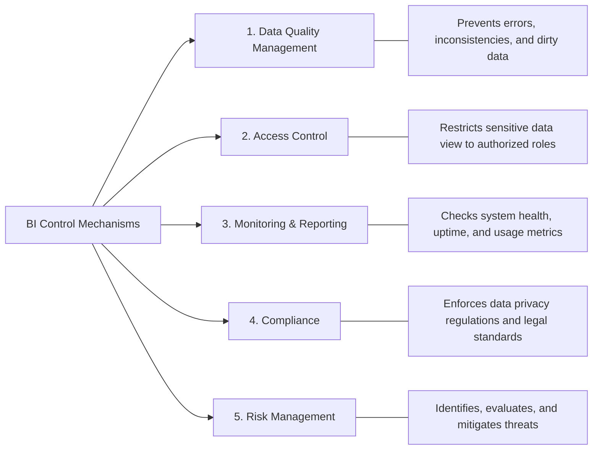
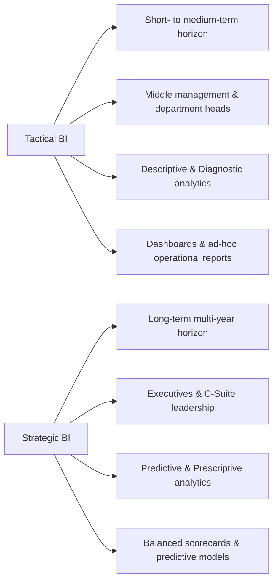

# BI Governance, Leadership & Stakeholders: Comprehensive Exam Reviewer

## Table of Contents

- [BI Governance, Leadership \& Stakeholders: Comprehensive Exam Reviewer](#bi-governance-leadership--stakeholders-comprehensive-exam-reviewer)
  - [Table of Contents](#table-of-contents)
  - [1. BI Leadership](#1-bi-leadership)
    - [Definition](#definition)
    - [Key Leadership Responsibilities](#key-leadership-responsibilities)
  - [2. BI Control Mechanisms](#2-bi-control-mechanisms)
  - [3. Stakeholder Roles \& Responsibilities](#3-stakeholder-roles--responsibilities)
  - [4. BI Governance Frameworks](#4-bi-governance-frameworks)
    - [Core Objectives of Governance](#core-objectives-of-governance)
  - [5. Tactical BI vs. Strategic BI](#5-tactical-bi-vs-strategic-bi)
    - [Direct Comparison Matrix](#direct-comparison-matrix)
  - [6. Ethical Implications in BI Decision-Making](#6-ethical-implications-in-bi-decision-making)
  - [7. Quick-Recall Exam Prep \& Cheat Sheet](#7-quick-recall-exam-prep--cheat-sheet)
    - [Common Exam Traps \& Key Rules](#common-exam-traps--key-rules)

---

## 1. BI Leadership

### Definition

BI Leadership is the process of guiding and managing the adoption, implementation, and application of BI tools, strategies, and data to drive organizational decision-making and improve performance.

### Key Leadership Responsibilities

* **Vision Setting:** Establishes strategic alignment, creates multi-year BI roadmaps, and communicates goals across business units.
* **Innovation:** Encourages advanced analytics adoption, evaluates emerging technologies, and fosters a safe culture of experimentation.
* **Resource Allocation:** Secures capital for software/hardware infrastructure and invests in hiring and upskilling talent.
* **Collaboration:** Facilitates cross-departmental knowledge sharing and aligns functional initiatives.
* **Driving Data Culture:** Promotes organization-wide data literacy and embeds data into routine decision workflows.

---

## 2. BI Control Mechanisms

**Definition:**

BI Control encompasses the governance processes used to regulate, monitor, and audit BI environments—ensuring data accuracy, system performance, security, and compliance.

---

## 3. Stakeholder Roles & Responsibilities

BI initiatives depend on five primary stakeholder groups, each bringing unique requirements and operational duties:

| Stakeholder Role | Key Resource Requirements | Primary Tasks & Duties |
| --- | --- | --- |
| **Executive Leadership** | Strategic vision, budget authority, organizational authority | Defines overall strategy, allocates capital, fosters culture, monitors high-level ROI. |
| **Business Users** | Domain expertise, operational process knowledge, tool access, training | Defines functional requirements, provides usability feedback, adopts tools, interprets business outputs. |
| **Data Analysts** | Advanced analytical skills, BI tool mastery, direct database access | Conducts ETL (extraction & transformation), builds reports/dashboards, performs exploratory analysis. |
| **IT Teams** | Systems engineering skills, server infrastructure, security protocols | Integrates enterprise systems, manages data architectures, implements security, troubleshoots system issues. |
| **End Users** | Basic data literacy training, accessible dashboard interfaces | Interacts with front-end data, provides feature feedback, complies with security policies, continuously learns tools. |

---

## 4. BI Governance Frameworks

**Definition:**

Governance Systems consist of the policies, processes, structures, and metrics that oversee data management and usage within the BI ecosystem.

### Core Objectives of Governance

1. **Accuracy:** Guarantees data integrity across all reporting systems.
2. **Security:** Restricts access to sensitive data and protects against breaches.
3. **Availability:** Ensures information is accessible to authorized users when needed.
4. **Compliance:** Adheres to industry regulations and data privacy laws.

---

## 5. Tactical BI vs. Strategic BI

Exam questions frequently compare operational short-term BI against long-term executive planning:

### Direct Comparison Matrix

| Aspect | Strategic BI | Tactical BI |
| --- | --- | --- |
| **Time Horizon** | Long-term (Years) | Short- to medium-term (Days to months) |
| **Primary Users** | Executives, C-Suite, Senior Management | Middle management, Department heads, Operational teams |
| **Scope** | Organization-wide, macro market trends | Departmental, unit-level operational performance |
| **Analytics Type** | Predictive and Prescriptive analytics | Descriptive and Diagnostic analytics |
| **Decision Focus** | High-level strategic planning, vision setting | Operational adjustments, daily process fixes |
| **Core Examples** | Mergers & acquisitions, market expansions | Daily sales tracking, customer service queue optimization |
| **Primary Tools** | Balanced scorecards, predictive models | Interactive dashboards, ad-hoc reports, visual charts |

---

## 6. Ethical Implications in BI Decision-Making

While BI tools provide powerful capabilities, relying on automated data processing introduces critical ethical considerations:

* **Algorithmic Bias:** Misconfigured models can perpetuate or amplify historical biases in hiring, credit scoring, or customer targeting.
* **Data Privacy & Surveillance:** Collecting granular user and employee data risks violating personal privacy standards if collected without informed consent.
* **Misrepresentation of Data:** Selective visualization or cherry-picked reporting metrics can manipulate stakeholders into inaccurate conclusions.
* **Over-reliance on Automated Outputs:** Blindly following predictive outputs without human intuition or ethical oversight can lead to unfair business practices.

---

## 7. Quick-Recall Exam Prep & Cheat Sheet

### Common Exam Traps & Key Rules

* **Leadership vs. Governance/Control:**
* **Leadership** sets direction, inspires culture, allocates budget, and encourages innovation.
* **Control/Governance** sets rules, enforces compliance, manages access, and guarantees data quality.

* **Analytics Mapping to BI Types:**
* **Tactical BI** = *Descriptive* (what happened) and *Diagnostic* (why it happened) analytics.
* **Strategic BI** = *Predictive* (what will happen) and *Prescriptive* (what action to take) analytics.

* **Data Quality Rule:** Garbage in, garbage out. **Data Quality Management** is the primary control mechanism that prevents erroneous data from corrupting executive decision-making.
* **Role Distinction:** If a question mentions *ETL operations, database transformation, or dashboard creation*, the primary role responsible is the **Data Analyst**.
