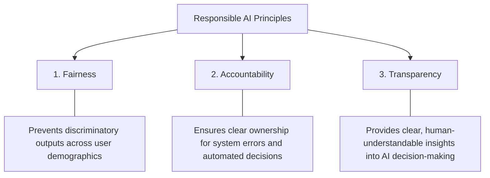
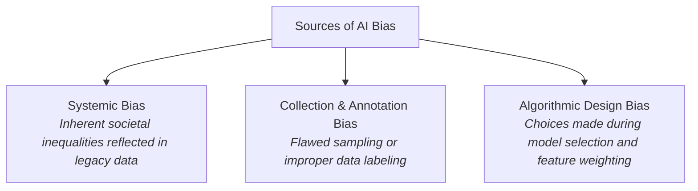
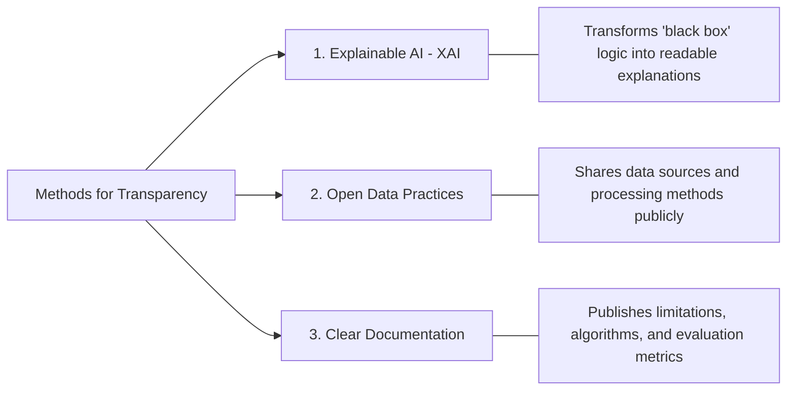
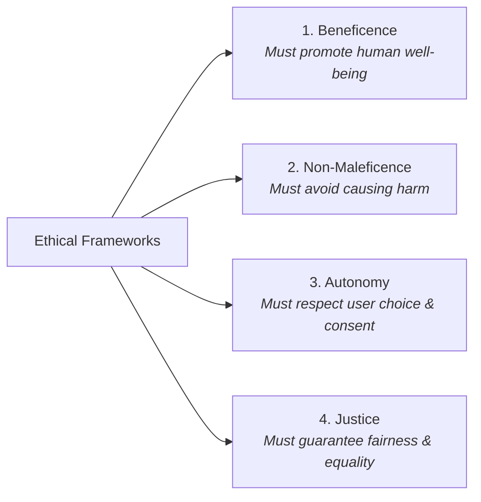

# Responsible & Ethical Business Intelligence: Comprehensive Exam Reviewer

## Table of Contents

1. [Core Concepts of Responsible AI](https://www.google.com/search?q=%231-core-concepts-of-responsible-ai)
2. [The 3 Pillars of Responsible AI](https://www.google.com/search?q=%232-the-3-pillars-of-responsible-ai)
3. [Fairness: Biases, Challenges & Mitigation](https://www.google.com/search?q=%233-fairness-biases-challenges--mitigation)
4. [Accountability: Black Boxes & Governance](https://www.google.com/search?q=%234-accountability-black-boxes--governance)
5. [Transparency: Methods & Real-World Implementations](https://www.google.com/search?q=%235-transparency-methods--real-world-implementations)
6. [Ethics & The 4 Core Principles](https://www.google.com/search?q=%236-ethics--the-4-core-principles)
7. [Real-World Case Studies of Unethical AI](https://www.google.com/search?q=%237-real-world-case-studies-of-unethical-ai)
8. [Philippine AI Legislative Landscape](https://www.google.com/search?q=%238-philippine-ai-legislative-landscape)
9. [Quick-Recall Exam Prep & Cheat Sheet](https://www.google.com/search?q=%239-quick-recall-exam-prep--cheat-sheet)

---

## 1. Core Concepts of Responsible AI

### AI in Business Intelligence vs. Traditional BI

* **Traditional BI:** Relies heavily on human queries and manual analytical workflows to compile historical data.
* **AI-Powered BI:** Uses machine learning (ML) algorithms and automated analytics to process complex, unstructured datasets—revealing hidden patterns and automated predictive trends.
* **Responsible AI:** A governing framework of operational principles ensuring that AI deployment remains legal, ethical, transparent, and aligned with human values.

---

## 2. The 3 Pillars of Responsible AI

---

## 3. Fairness: Biases, Challenges & Mitigation

### Why Fairness Matters

Guarantees equal opportunities across demographic groups (e.g., gender, ethnicity), enhances trust in enterprise BI tools, and prevents automated discrimination.

### Sources of Bias in AI Systems

### Mitigation Strategies for BI Teams

1. **Diverse Datasets:** Train algorithms on representative datasets matching target populations.
2. **Bias Detection Tools:** Deploy continuous auditing software to monitor disparate impact scores across groups.
3. **Regular Algorithmic Audits:** Evaluate outputs over time to detect emergent bias patterns.

---

## 4. Accountability: Black Boxes & Governance

### Definition

Ensuring that organizations and developers are answerable for the outcomes, errors, and societal impacts of their deployed AI systems.

### Primary Challenges to Accountability

* **The "Black Box" Problem:** Deep neural networks process parameters in ways that are difficult for humans to trace or comprehend.
* **Emergent Behavior:** Complex models can exhibit unintended actions that were never explicitly programmed.
* **Shared/Blurred Responsibility:** Difficult to assign singular blame when outputs involve data providers, developers, corporate users, and platform vendors.

### Strategies for Enforcing Accountability

* **Governance Frameworks:** Establish internal ethics boards, clear policies, and continuous risk management frameworks.
* **Traceable Documentation:** Maintain end-to-end documentation across the AI lifecycle (data provenance, training metrics, limitations).
* **Clear Ownership Lines:** Assign explicit authority and legal responsibility to individual roles and oversight bodies.

---

## 5. Transparency: Methods & Real-World Implementations

### 3 Core Methods to Achieve Transparency

### Industry Implementations of AI Transparency

| Company / Platform | Primary Focus | Implementation Example |
| --- | --- | --- |
| **Google** | XAI & User Privacy | Introduced **My Ad Center** and search insights so users see why specific ads are targeted and adjust preferences. |
| **IBM Watson** | Healthcare Diagnostics | Breaks down medical literature, history, and imaging used to formulate a diagnostic recommendation for physicians. |
| **Waymo** | Autonomous Driving | Shares LiDAR/radar point-cloud visualizations, simulation datasets, and behavioral prediction models with regulators. |
| **Meta (Facebook)** | Feed Recommendations | Deployed the **"Why am I seeing this?"** feature to explain content algorithmic feeds and reduce misinformation. |

---

## 6. Ethics & The 4 Core Principles

1. **Beneficence (Do Good):** Systems should be designed to improve human outcomes (e.g., early disease detection algorithms in healthcare).
2. **Non-Maleficence (Do No Harm):** Systems must prioritize safety and avoid injury (e.g., self-driving software prioritizing pedestrian safety).
3. **Autonomy (Respect Choice):** Users retain ultimate agency and right of refusal (e.g., customer service bots providing human-agent escalation options).
4. **Justice (Be Fair):** Eliminates discrimination across demographic lines (e.g., unbiased resume screening tools).

---

## 7. Real-World Case Studies of Unethical AI

### Case Study 1: Algorithmic Discrimination (Law Enforcement)

* **Incident:** In 2020, **Robert Williams** (an African-American man) was wrongfully arrested in Detroit due to a false facial recognition match.
* **Technical Root Cause:** Training data lacked diverse representation. MIT studies found commercial facial recognition systems had an error rate of **34.7% for dark-skinned women** vs **0.8% for light-skinned men**.
* **Violated Principles:** **Fairness, Justice, and Non-Maleficence**.

### Case Study 2: Privacy Breach & Data Manipulation (Elections)

* **Incident:** The **Cambridge Analytica / Facebook Scandal (2018)** involved unauthorized harvesting of 87 million user profiles without explicit consent.
* **Technical Root Cause:** Data was collected via a third-party quiz app ("This Is Your Digital Life") which scraped data from quiz takers and their friends list, feeding psychological profiling models for political manipulation.
* **Regulatory Result:** Meta was fined **$5 Billion by the U.S. FTC** and accelerated the global enforcement of strict privacy regulations like the EU GDPR.
* **Violated Principles:** **Autonomy, Consent, and Data Privacy**.

---

## 8. Philippine AI Legislative Landscape

The Philippines has introduced legislative measures to regulate AI development, labor protection, and ethics:

* **House Bill No. 7396:** *Artificial Intelligence Development and Regulation Act of the Philippines* (Focuses on national development and regulatory structures).
* **House Bill No. 9448:** *Protection of Labor Against Artificial Intelligence Automation Act* (Protects workforce displacement and employee rights against unchecked automation).
* **House Bill No. 7913:** *Artificial Intelligence Regulation Act* (Establishes ethical guidelines and compliance standards for AI systems).

---

## 9. Quick-Recall Exam Prep & Cheat Sheet

### High-Yield Facts & Key Distinctions

* **XAI (Explainable AI):** The specific technological domain designed to convert complex "black box" decisions into human-interpretable logic.
* **Emergent Behavior:** When an AI model develops unpredictable behaviors or outputs that developers did not explicitly code or intend.
* **Disparate Error Rates:** Facial recognition systems historically exhibit significantly higher error rates on dark-skinned individuals due to unbalanced training sets.
* **Consent vs. Usage:** **Consent** means getting explicit user permission *before* gathering data; **Data Usage** governs *how* that collected data is processed ethically without deceptive intent.
* **Key Philippine AI Laws:**
* HB 7396 (Development & Regulation)
* HB 9448 (Labor Protection)
* HB 7913 (AI Regulation)
