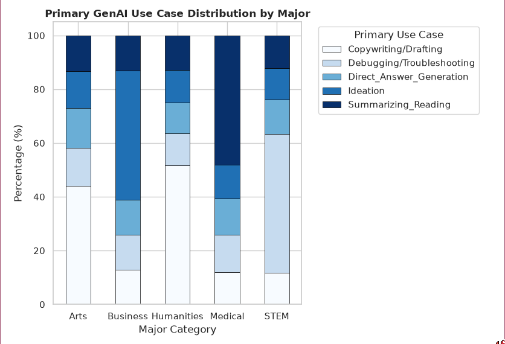
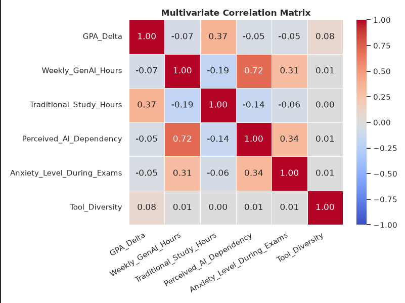
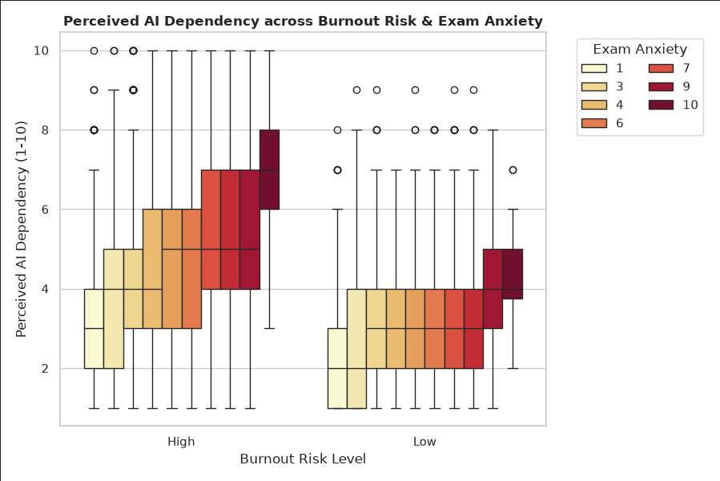

# Ai Impact on Students

## 1. Team Members

- Member 1: Cyrus Troy Bazar

---

## 2. Dataset Collection and Description

### AI Impact on Students

**Source:** Kaggle / Public Dataset

**Dataset Link:**  <https://www.kaggle.com/datasets/dspritom/ai-impact-on-students>

**Number of Variables:** total 15 columns

**Number of Observations:** 28856 |

### Variables

| Variable                       | Data Type           | Description                                                                                                                   |
| ------------------------------ | ------------------- | ----------------------------------------------------------------------------------------------------------------------------- |
| **Student_ID**                 | Integer             | A unique identification number assigned to each student.                                                                      |
| **Major_Category**             | Categorical         | The student's academic major or field of study.                                                                               |
| **Year_of_Study**              | Categorical         | The student's current year level in their academic program.                                                                   |
| **Pre_Semester_GPA**           | Numerical (Float)   | The student's GPA before the semester began.                                                                                  |
| **Weekly_GenAI_Hours**         | Numerical (Float)   | The number of hours per week the student spends using generative AI tools.                                                    |
| **Primary_Use_Case**           | Categorical         | The student's main purpose for using generative AI, such as studying, coding, research, or writing.                           |
| **Prompt_Engineering_Skill**   | Categorical         | The student's level of skill in creating and designing effective prompts for generative AI tools.                             |
| **Tool_Diversity**             | Numerical (Integer) | The number of different generative AI tools used by the student.                                                              |
| **Paid_Subscription**          | Categorical         | Indicates whether the student uses a paid subscription to a generative AI service.                                            |
| **Traditional_Study_Hours**    | Numerical (Float)   | The number of hours per week the student spends studying without generative AI tools.                                         |
| **Perceived_AI_Dependency**    | Numerical (Integer) | A score representing how dependent the student feels on generative AI for their academic activities.                          |
| **Institutional_Policy**       | Categorical         | Indicates the level or type of institutional policy governing the use of generative AI in the student's academic environment. |
| **Anxiety_Level_During_Exams** | Numerical (Integer) | A score representing the student's level of anxiety experienced during examinations.                                          |
| **Post_Semester_GPA**          | Numerical (Float)   | The student's GPA after completing the semester.                                                                              |
| **Burnout_Risk_Level**         | Categorical         | The student's categorized level of risk for experiencing academic burnout.                                                    |

### Unit of Observation

Each row represents one student.

### Data Collection

This data set comes with a codebook on the Kaggle site.

---

## 3. Broad Research Question

- Does Ai Impacts students performance on academics?
- Do students with high AI usage decrease their traditional study hours proportionately, and how does this tradeoff impact performance?
- Primary Use Case Impact: How do different primary uses of AI (e.g., coding assistance, essay writing, summarizing notes, or test prep) vary in their effect on student GPA?

---

## 4. Data Exploration

The dataset was first inspected to determine its size, variables, data types, missing values, duplicate records, and possible invalid values.

The dataset contains `15 variables` and `28856 | observations`.

Initial inspection showed that 8 variables were numeric and suitable for statistical analysis.

---

## 5. Data Cleaning and Pre-processing

The following preprocessing steps were performed:

- Checked the dataset for missing values.
- Checked for duplicate records.
- Checked whether numerical variables contained invalid values.
- Verified the data types of each variable.
- Examined extreme values and possible outliers.
- Removed or corrected invalid records where necessary.

After preprocessing, the dataset was considered suitable for exploratory analysis.

---

## 6. Missing Data Analysis

```py
import pandas

df = pandas.read_csv("./data.csv")

df.info
```

|  Column |   Non-Null Count  | Dtype |
| - | - | - |
| 0   Student_ID         |         28856 | non-null  int64  
| 1   Major_Category      |        28856 | non-null  object 
| 2   Year_of_Study        |       28856 | non-null  object 
| 3   Pre_Semester_GPA      |      28856 | non-null  float64
| 4   Weekly_GenAI_Hours     |     28856 | non-null  float64
| 5   Primary_Use_Case        |    28856 | non-null  object 
| 6   Prompt_Engineering_Skill |   28856 | non-null  object 
| 7   Tool_Diversity            |  28856 | non-null  int64  
| 8   Paid_Subscription     |      28856 | non-null  object 
| 9   Traditional_Study_Hours  |   28856 | non-null  float64
| 10  Perceived_AI_Dependency   |  28856 | non-null  int64  
| 11  Institutional_Policy     |   28856 | non-null  object 
| 12  Anxiety_Level_During_Exams | 28856 | non-null  int64  
| 13  Post_Semester_GPA       |    28856 | non-null  float64
| 14  Burnout_Risk_Level       |   28856 | non-null  object |

This shows that theres no missing values in our dataset.

---

## 7. Descriptive Statistics

**Demographic and AI Usage:**

| Metric | Student_ID | Pre_Semester_GPA | Weekly_GenAI_Hours | Tool_Diversity |
| :--- | :--- | :--- | :--- | :--- |
| count | 28856.00000 | 28856.000000 | 28856.000000 | 28856.000000 |
| mean | 114428.50000 | 3.151702 | 9.218165 | 2.800353 |
| std | 8330.15402 | 0.478808 | 9.300575 | 1.189669 |
| min | 100001.00000 | 1.183000 | 0.000000 | 1.000000 |
| 25% | 107214.75000 | 2.838000 | 2.350000 | 2.000000 |
| 50% | 114428.50000 | 3.218000 | 5.950000 | 3.000000 |
| 75% | 121642.25000 | 3.527000 | 12.980000 | 4.000000 |
| max | 128856.00000 | 3.997000 | 40.000000 | 5.000000 |

**Study Habits, Wellbeing & Academic Outcomes:**

| Metric | Traditional_Study_Hours | Perceived_AI_Dependency | Anxiety_Level_During_Exams | Post_Semester_GPA |
| :--- | :--- | :--- | :--- | :--- |
| count | 28856.000000 | 28856.000000 | 28856.000000 | 28856.000000 |
| mean | 11.150396 | 3.608296 | 4.344261 | 3.350033 |
| std | 5.187562 | 1.947710 | 2.195916 | 0.497251 |
| min | 1.000000 | 1.000000 | 1.000000 | 1.000000 |
| 25% | 7.450000 | 2.000000 | 3.000000 | 3.025000 |
| 50% | 11.110000 | 3.000000 | 4.000000 | 3.423000 |
| 75% | 14.670000 | 5.000000 | 6.000000 | 3.750000 |
| max | 35.860000 | 10.000000 | 10.000000 | 4.000000 |

---

## 8. Visualization

**GenAi Use Case Distribution by Major 100% stacked bar:**



This stacked bar shows the percentage of primary use case of ai in different Major categories.

- `Humanities` and `Arts` Students uses Ai for drafting.
- `Buseness` Students use it mostly for ideas.
- `Medical` Students use it to Summarize reading
- And `STEM` Students use it for Direct answer generations.

**Multivariate Corelation Martix:**



The correlation matrix shows the strength and direction of the relationships between `GPA Delta`, `GenAI usage`, `traditional study hours`, `perceived AI dependency`, `exam anxiety`, and `tool diversity`. 

- `GPA Delta & Traditional Study Hours` have **0.37** Moderate positive relationship. Students who spend time on Traditional Study hours are likely to have higher GPA.
- `Weekly GenAI Hours & Anxiety During Exams` have **0.31** Weak to moderate positive relationship, meaning Greater Genai Usage is somewhat associated with anxiety levels during exam

**Grouped Box Plot (AI Dependency vs. Burnout Risk):**



The box plot shows how students' perceived AI dependency (1–10) varies according to their burnout risk level and exam anxiety level. Each box/bar represent Exam Anxiety levels.

- **Low burnout risk level:** AI dependency is generally lower, with most median values around 2–4.
- **High Burnout Risk:** Students generally show higher AI dependency with median values mostly around 3–6 depending on exam anxiety.
- **Outliers:** This also shows the data outliers as a dot.
- **Exam Anxiety:** Within the High burnout group, higher anxiety levels tend to be associated with higher AI dependency.

---

## 9. Specific Research Question

- **Specific Hypothesis:** We hypothesized that higher Ai usage on academics leads to less burnout risks and stress thinking.

- **Findings:** The graphs reveal that students spending more time on Ai most likely to develop burnout and stress.
